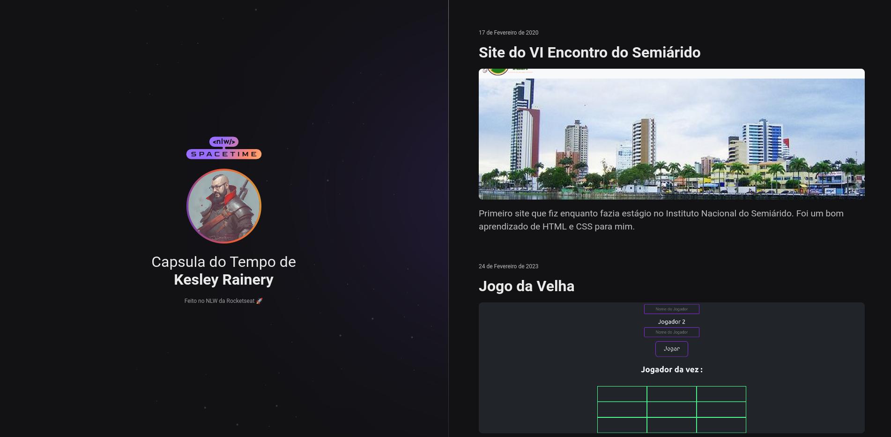

<h1 align="center"> < NLW/ Spacetime> Capsula do Tempo 🚀</h1>

  <a href="#-tecnologias">Tecnologias</a>&nbsp;&nbsp;&nbsp;|&nbsp;&nbsp;&nbsp;
  <a href="#-projeto">Projeto</a>&nbsp;&nbsp;&nbsp;|&nbsp;&nbsp;&nbsp;
  <a href="#memo-licença">Licença</a>

  

<h2 align="center"> Preview </h2>
  

  

## 🚀 Tecnologias

   
Esse projeto foi desenvolvido com as seguintes tecnologias:  
    
    
    

 
## 💻 Projeto

  <ul>
    <li>Autor : <a href="https://github.com/BerserKess">Kesley Rainery</a>
</li>
    <li>
Projeto proposto pela Rocketseat 🚀 que consiste em criar uma "capsula do tempo" para guardar memorias e eventos importantes da nossa vida.

</li>
   </ul>
   

## 🔧 Recursos e Funcionalidades

    <ul>
        <li>Design responsivo, adaptando-se a diferentes tamanhos de tela e dispositivos.
        </li>
        <li>Utilização de HTML semântico para uma melhor acessibilidade e indexação nos mecanismos de busca.
        </li>
        <li>Estilização do site com CSS, aplicando princípios de design e boas práticas.
        </li>
    </ul>

## 📗 Instruções de Uso

    <ol>
        <li>Clone este repositório em sua máquina local.</li>
        <li>Abra o arquivo `index.html` em seu navegador web.</li>
        <li>Navegue pelo site para explorar as diferentes páginas e funcionalidades implementadas.</li>
        <li>Personalize o projeto de acordo com suas necessidades, adicionando seu próprio estilo e recursos.</li>
    </ol>

## Contribuição

Contribuições são bem-vindas! Se você deseja melhorar este projeto, sinta-se à vontade para fazer um fork do repositório, implementar suas modificações e enviar uma pull request.

## 📝 Licença

Este projeto está licenciado sob a [MIT License](LICENSE).
